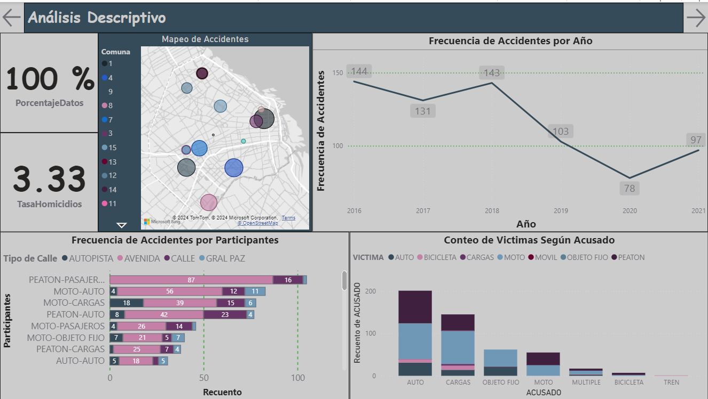
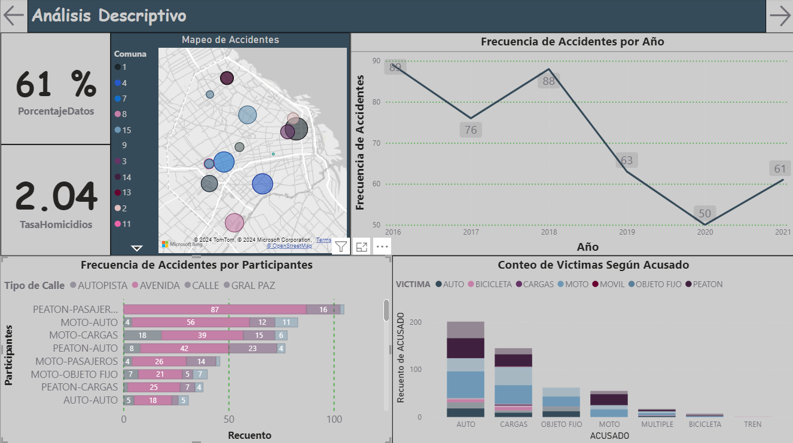
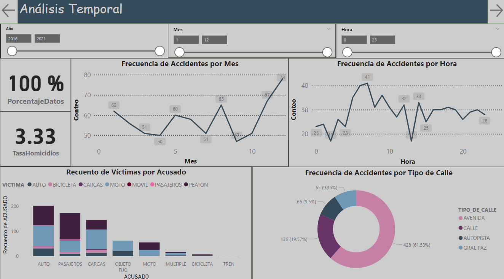
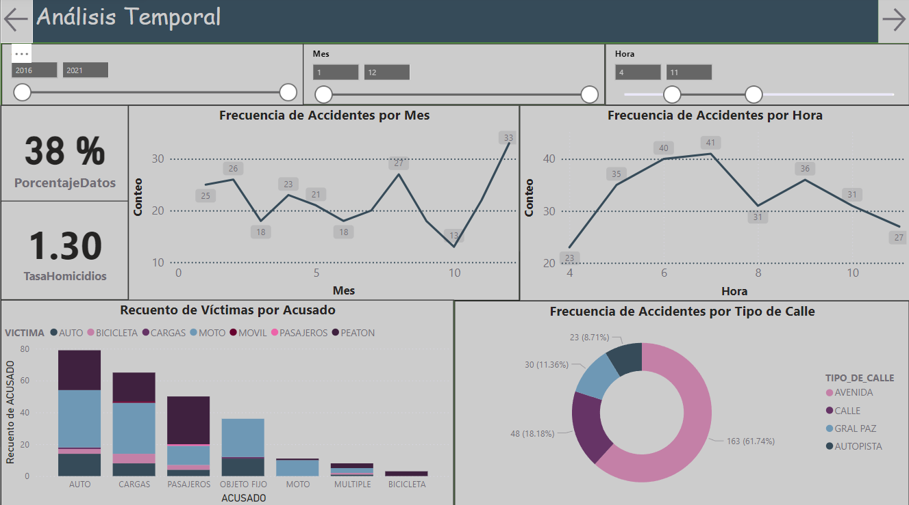
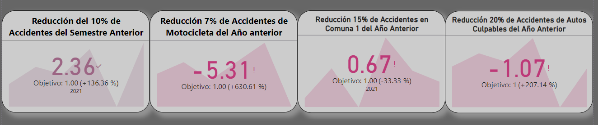

# Presentación.

Éste es un proyecto en el que desarrollé un análisis con datos proporcionados por el Observatorio de Movilidad y Seguridad Vial (OMSV), centro de estudios que se encuentra bajo la órbita de la ***Secretaría de Transporte*** del Gobierno de la Ciudad Autónoma de Buenos Aires. Dicha organización pide una recopilación de información focalizada a reducir siniestros viales.

# Vistazo General.

El proyecto consta de los archivos:

- SiniestrosViales.pbix: El dashboard creado con [Power BI Desktop](https://powerbi.microsoft.com/es-es/desktop/).

y de las carpetas:

- Datasets: En donde se guarda el dataset utilizado con su respeectivo diccionario.
- EDA: En donde hay un Jupyter Notebook, con una análisis exploratorio de datos.
- Images: En donde se guardan varias imagenes usadas en el proyecto.

# Dashboard.

Con el **Mapeo de Accidentes** se puede observar que las comunas 1, 4, 9, 8 tienen una tendencia más alta que las demás, con **Frecuencia de Accidentes por Año** se aprecia que si bien al principio los accidentes tienen un conteo alto, en los años consiguientes se muestra una clara disminución, de manera que la estrategia que se haya empleado fue la indicada. Por otro lado, con  **Frecuencia de Accidentes por Participantes**, en primera instancia, se puede apreciar que los peatones (víctimas) son quienes están más involucrado en siniestros viales; en segunda instancia, motocicletas tienen una alta recurrencia en el gráfico. Como apoyo a la anterior gráfica, con **Conteo de Víctimas Según Acusado** se puede apreciar que los autos son los participantes a los que se les señala de culpables, teniendo como víctimas principales a peatones y motocicletas.

Apoyando la premisa anterior acerca de las avenidas, podemos ver que el 61% de los datos recopilados ocurrieron en avenidas por lo que se deben tomar medidas preventivas.

Con **Frecuencia de Accidentes por Mes**, se aprecia que en su mayoría la distribución es uniforme, sin embargo, al parecer en Noviembre y Diciembre hay una alta tendencia de siniestros viales. De una forma muy similar, con **Frecuencia de Accidentes por Hora** se aprecia que los siniestros viales están muy distribuidos a lo largo del día, aunque hay una alta tendecia entre las 4:00 a.m y las 11:00 a.m. 

Como apoyo a la premisa anterior acerca de las horas con alta tendencia, se puede apreciar que representan un 38% de los siniestros viales; además, con **Recuento de Víctimas por Acusado** apreciamos como las motos como víctimas de automóviles tienen una incrementan en porcentaje.

Con relación a las metas propuestas, la **Reducción del 10% de Accidentes del Semestre Anterior** tuvo un buen rendimiento al reducir un 13% más de lo propuesto; la **Reducción del 7% de Accidentes de Motocicleta del año anterior** tuvo un pésimo rendimiento pues no sólo no se llegó a la meta sino que los accidentes aumentaron aproximadamente un 35%, por lo que se deben toman medidas preventivas; con la **Reducción del 15% de Accidentes en la Comuna 1 del Año Anterior**  tuvo un rendimiento regular pues si bien, no se llegó a la meta, está muy  cerca; y por último, la **Reducción del 20% de Accidentes de Autos Culpables del Año Anterior** tuvo un mal rendimiento pues los accidentes aumentaron aproximadamente un 20%, por lo que se deben tomar medidas preventivas.
